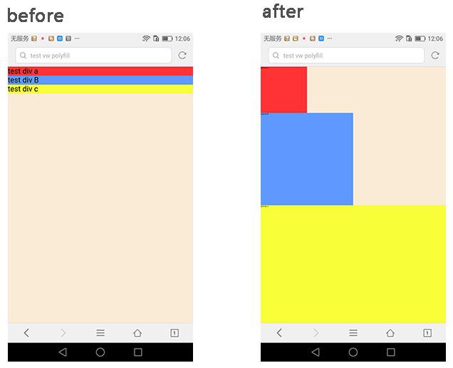

本文复制于：https://github.com/RaySnow/vw-polyfill/blob/master/other.md

这两年小程序开发火爆，小程序推荐使用的[rpx单位](https://developers.weixin.qq.com/miniprogram/dev/framework/view/wxss.html)，即：750的设计稿，1rpx=1px，750rpx=100vw=100%，这个方案最大的好处在于，设计稿标记的尺寸可以直接用来写css，不需要任何工具计算，开发者无需考虑兼容问题，都由小程序自己去兼容。 这给了我们团队一个启发：为什么我们不把rpx单位或者说这种思想推广开来呢，于是我们提出一个方案：***把rpx用于整个前端开发，包括小程序、h5以及其他，打包时把rpx转换为vw，不支持vw的浏览器做降级，开发者无需考虑单位转换***。

这里简单介绍下我们建议的方案：

1. 使用rpx书写css，1rpx=1px（设计稿原始单位）
2. 根据应用环境区分打包的时候要不要把rpx转为vw（小程序就不需要转换了），转换方法建议用postss插件：[postcss-rpx-to-viewport](https://github.com/RaySnow/postcss-rpx-to-viewport)
3. 判断自己的应用是否需要做vw降级，需要的话，只需在html文件中body标签最前面或最后面引入（或直接插入源代码）[vw-polyfill](https://github.com/RaySnow/vw-polyfill)

非常简单2-3步，搞定移动端多屏适配

上代码：

```css 
.foo {
  width: 750rpx;
  height: 150rpx;
  margin: 10rpx;
  padding: 1px 1rpx 1px 1rpx; /* all rpx will be converted */
  border: 4px solid gray;   /* px will not be converted */
  font-size: 15rpx;
  line-height: 14rpx;
}
.foo {
  width: 100vw;
  height: 20vw;
  margin: 1.33333vw;
  padding: 6px 0.8vw 6px 0.8vw; /* all rpx will be converted */
  border: 4px solid gray;   /* px will not be converted */
  font-size: 2vw;
  line-height: 1.86667vw;
}
.foo {
  width: 100rem;
  height: 20rem;
  margin: 1.33333rem;
  padding: 6px 0.8rem 6px 0.8rem; 
  border: 4px solid gray;  
  font-size: 2rem；
  line-height: 1.86667rem;
}
```

### 写在前面

本文假设你已经了解移动端多屏适配的一些必要知识，如 viewport、rem、vw、dpr、meta标签等，如果有不熟悉的地方， 请移步：[使用Flexible实现手淘H5页面的终端适配](https://www.w3cplus.com/mobile/lib-flexible-for-html5-layout.html) [再聊移动端页面的适配](https://www.w3cplus.com/css/vw-for-layout.html) 两篇文章，讲的非常棒。

从接触移动端开始，我们就被各种尺寸和密度的手机屏幕所烦恼，为了让设计稿要在不同手机屏幕上有相对一致性的表现，我们先后尝试过很多方案。比如：

1. 用百分比进行布局，px做细节处理 （缺点：不精准）
2. 用meta标签针对屏幕大小写多个版本的css （缺点：太麻烦了）
3. 用rem单位，用meta标签设置htmlfont-size（缺点：只能根据屏幕大小分几级去兼容，不能做到完全兼容）
4. 大概15年底的时候，感谢@大漠的flexible.js(上面第一篇文档)，通过js动态改变htmlfont-size来模拟vw的方案比较好的解决了我们面临的问题（当然，这里也存在一些问题，具体就不展开了）

如今，vw已经获得大多数浏览器的支持，rem模拟vw的方案就不再是必须的了。下面聊聊怎么样使用vw做适配

## 方案优势

让我们就几个问题来一起看下，新方案有哪些好处：

1. 为什么要用vw替代rem？

   - rem方案的初衷，其实就是模拟vw，现在vw已经得到大多数浏览器的支持，rem就不再是必须的了
   - flexible方案需要额外引入js文件，还需要放啊head中，对于页面性能来说，自然还有有点影响的。
   - js动态改变html font-size的方案，会触发整个页面样式重新渲染，在部分浏览器上有肉眼可见的延迟样式变动，体验不好。
   - vw单位更直观易懂，1vw就是页面宽度的1%，很好理解，rem就需要各种换算了。。。

2. vw兼容性如何？

   - 虽然说大部分浏览器都已经支持vw单位了，但是主流机型中，仍然有一小撮是不支持的，要不要做降级，看自己的产品对应机型做取舍了。
   - 实际测试中，会发现不支持的机型和浏览器，其实不止下图中这些，很多安卓高版本的部分浏览器也不支持。详细看：[caniuse](https://caniuse.com/#search=vw)、[再聊移动端页面的适配](https://www.w3cplus.com/css/vw-for-layout.html)

3. 为什么要用rpx？

   - 如果你也面临同时开发小程序和h5~
   - 如果你也经历过设计稿标注出来100px，需要在心中除以2，再写到css文件上；
   - 还要写各种less/sass 函数、混合宏？太麻烦；
   - 用浏览器插件自动转换？rem的代码不好理解和维护；
   - 用post插件自动转换？要在px后面写注释，告诉插件这个地方不用转换，神烦；
   - 用了rpx后，只需要在需要转换的地方写rpx，不需要的写px就好啦，互相没影响。当然"rpx"只是个建议，你也可以用其他的代替，区分于"px"就好了~

4. 如何方便的做降级？

   - 调研了几款做vw降级的方案（没兴趣看细节直接略过，看下面一条解决方案），包括： [Viewport Units Buggyfill](https://github.com/rodneyrehm/viewport-units-buggyfill) 和[vminpoly](https://github.com/saabi/vminpoly) 其中 Viewport Units Buggyfill的方案大概是在css打包的使用，结合插件[postcss-viewport-units](https://github.com/springuper/postcss-viewport-units)，把需要转换单位的样式都添加一个content属性，样式内容额外插入content一份。页面加载时初始化 Viewport Units Buggyfill，判断浏览器型号，根据是否安卓、版本等决定是否要采用降级，这个判断方法不是很严谨，实际测试中，很多安卓高版本的手机（比如安卓6）也会存在vw不支持的情况，比如华为p9、mate9等, 然后通过document.styleSheets获取所有样式和content，把content属性中的备用样式插入 到样式表中，听起来就特别麻烦不是么。。。。用的时候也很麻烦，要在打包中配置两个插件、html中还要再引用一个，另外css文件体积也会变大，毕竟额外增加了很多content属性。 vminpoly的方案感觉好一些，采用插入元素的方法动态判断浏览器是否支持，然后重新加载css源码把vw转换为px，缺点是页面宽度变动的时候，需要重新转换并渲染，而且vminpoly有点大，10kb左。
   - 于是，我们做了[vw-polyfill](https://github.com/RaySnow/vw-polyfill)这款降级方案，借鉴了一些上面方案的优势，比如动态检测浏览器是否支持vw的办法 但是在方案上选择了直接把vw转换为rem的方案，设置下html的font-size。***实现1rem=1vw***。页面宽度变化的时候，只需要更改html font-size，不需要全部重新转换vw。 ***性能更高*** ，整个方案有 ***更好的兼容性*** ，而且很小， ***只有1kb*** 由于vw单位已经获得了大多数浏览器的支持，如果你不想让为了少数浏览器的降级影响多数用户的页面体验（虽然已经非常小），可以放在body标签最后加载，牺牲一丢丢不支持vw浏览器的用户体验。
   - 有兴趣了解的请移步：[vw-polyfill](https://github.com/RaySnow/vw-polyfill), 不到100行代码，只需要引入（建议直接注入html）一个js文件，没有任何依赖，也不需要其他插件配合，就可以轻松实现降级。 例：

   ```
   * {
       padding: 0;
       margin: 0;
       box-sizing: border-box;
   }
   .a {
       width: 25vw;
       height: 25vw;
       background-color: #ff3336;
   }
   .b {
       width: 50vw;
       height: 50vw;
       background-color: #5f98ff;
   }
   ```

   ```html 
   <head>
     <meta charset="utf-8"/>
     <title>test vw polyfill</title>
     <meta name="viewport" content="width=device-width, initial-scale=1">
     <link rel="stylesheet" href="test.css">
     <style>
       .c {
         width: 100vw;
         height: 100vw;
         background-color: #f8ff38;
       }
     </style>
     <style>
       body {
         background-color: antiquewhite;
       }
     </style>
   </head>
   <body>
   <div class="a">
     test div a
   </div>
   <div class="b">
     test div B
   </div>
   <div class="c">
     test div c
   </div>
   <script src="../vw-polyfill.min.js"></script>
   </body>
   ```

   效果：

1. 如何书写和打包？
   - 假设我们的设计稿是750px，元素A（class a）标注是100px，你只需要写 .a {width: 100rpx} 即可
   - rpx转为vw的办法有很多，在此我们建议使用：[postcss-rpx-to-viewport](https://github.com/RaySnow/postcss-rpx-to-viewport)，不需要任何设置，直接在打包的时候加入。如何应用在vue和react项目中，请点击查看readme。
   - 如果你的设计稿不是750也不影响，只需设置下插件的 {layoutWidth: '你的设计稿尺寸'}
   - 这样你的css文件仍然保留rpx单位，和设计稿一一对应，更利于后期维护。
   - 其他rpx转vw的方法，还有很多，比如其他postCss插件、编辑器插件、less/sass 函数、混合宏等，可以自行选择，这里就不展开了。

## 其他问题

1. 关于retina屏幕下实现 1px 方案

这个网上有挺多办法的，早版本的flexible方案把解决办法内置了，个人感觉有点重，还会造成写字体书写要结合css属性 [data-dpr="2"] 来写，建议大家还是在需要的时候自己另外处理吧。 有兴趣请移步[移动端1px细线解决方案总结](https://www.cnblogs.com/lunarorbitx/p/5287309.html)

1. 关于retina屏幕下 @2x @3x 图片高清适配

同上，由于不是所有的图片都需要采用@2x @3x方案，大家在需要的时候，可以选择增加 @media 做适配，或者利用postCss插件做自动化、结合阿里云/其他云的图片处理接口。 当然，也有很多其他的方法，大家自行选择哈 例：

```css 
/* 普通显示屏(设备像素比例小于等于1)使用1倍的图 */
.css{
  background-image: url(img@1x.png);
}

/* 高清显示屏(设备像素比例大于等于2)使用2倍图  */
@media only screen and (-webkit-min-device-pixel-ratio:2){
  .css{
    background-image: url(img@2x.png);
  }
}

/* 高清显示屏(设备像素比例大于等于3)使用3倍图  */
@media only screen and (-webkit-min-device-pixel-ratio:3){
  .css{
    background-image: url(img@3x.png);
  }
}     
```

1. 关于字体大小是否使用vw

布局和影响视觉的字体，建议直接使用vw（即rpx），比如slogan、title等，还是那句话，设计稿标注是多少，就用多少，不需要[data-dpr="2"]这种~ 大段的描述性文本、段落可以酌情选择，建议使用px，大屏手机可以展示更多文本，而不是（rpx、vw）简单的变大

1. 关于雪碧图

和rem方案一样，由于转换后单位的小数，会造成雪碧图偏差，建议使用其他方案代替比如base64，用也还是可以的，解决办法网上很多网上也有很多 可以自己搜索或移步：[手淘的Flexible方案能使用雪碧图吗？](https://www.zhihu.com/question/48436859)

以上，文中部分引用均用超链接的形式标出

如有不准确之处，欢迎留言拍砖~


----

### 根据设备尺寸将px转化为vw

```js
function px2VwForStyleObj(styleObj, opts = {}) {
  const defaults = {
    viewportWidth: 320,
    viewportHeight: 568,
    unitPrecision: 5,
    viewportUnit: 'vw',
    landscapeUnit: 'vw',
  };
  const options = Object.assign({}, defaults, opts)
  const pxRegex = new RegExp(/(\d+)px/.source, 'ig')
  const stylesStr = JSON.stringify(styleObj);
  const toFixed = (number, precision) => {
    const multiplier = Math.pow(10, precision + 1);
    const wholeNumber = Math.floor(number * multiplier);
    return Math.round(wholeNumber / 10) * 10 / multiplier;
  }
  const createPxReplace = (optionsArg, viewportUnit, viewportSize) => {
    return function (m, $1) {
      if (!$1) return m;
      const pixels = parseFloat($1);
      if (pixels <= optionsArg.minPixelValue) return m;
      const parsedVal = toFixed((pixels / viewportSize * 100), optionsArg.unitPrecision);
      return parsedVal === 0 ? '0' : parsedVal + viewportUnit;
    };
  }

  return JSON.parse(stylesStr.replace(pxRegex, createPxReplace(options, options.landscapeUnit, options.viewportWidth)));
}

// 使用：
tabBarUnderlineStyle={px2VwForStyleObj({ height : '10px' })}
```

