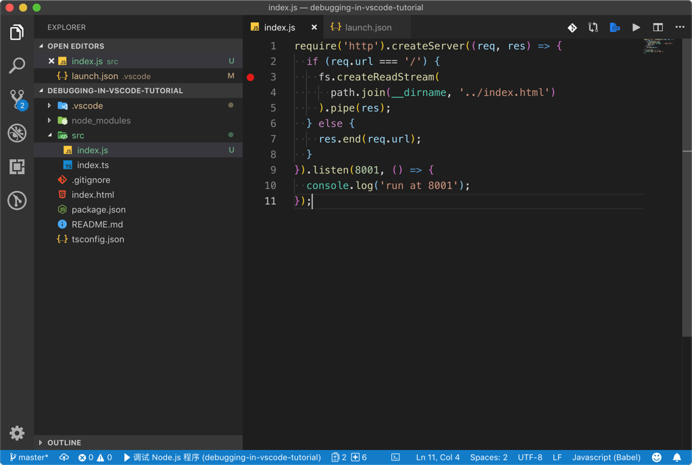
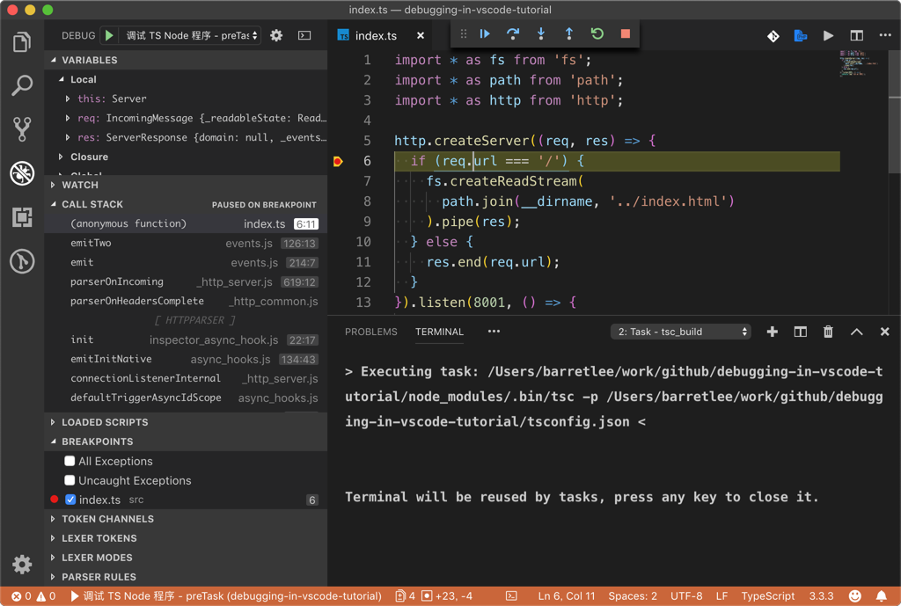
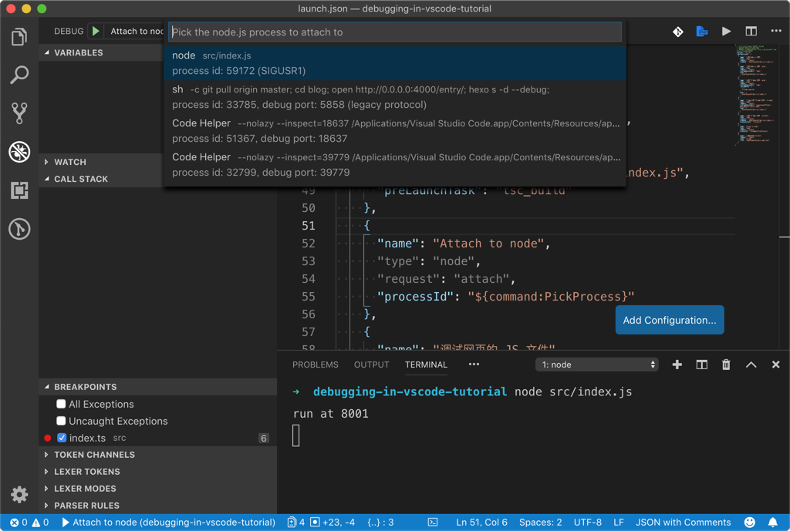
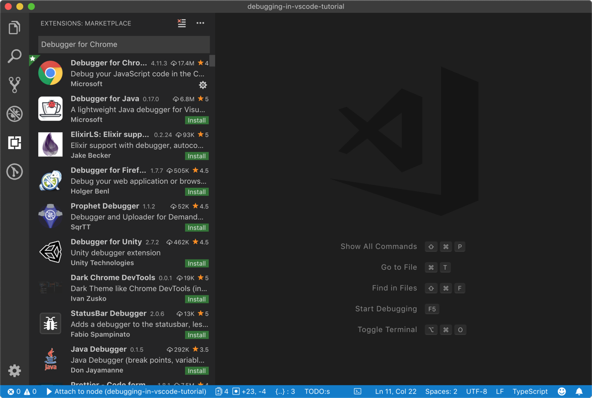

# VSCode 调试中 launch.json 配置不完全指南

经常使用 VSCode 的同学多多少少会看到项目中有这么一个文件夹 `.vscode`，这是一个在 VSCode 软件上才能发挥作用的配置文件夹，它一般是跟随项目的，其用途与我们平时看到的 `jsconfig.json`, `.editor.config` 等相似，都是为了对工程做更多的约束，或者对代码做更多的规范化处理。

VSCode 内置了对 Node.js 的调试支持，如果你需要调试其他语言如 C++、PHP、Python 等，可以在 VSCode 的插件市场安装对应的插件。由于调试的技巧和配置在语言之间的差异不大，文本将以 Node.js 的调试为例进行讲解。

调试的官方基础文档在 [这里](https://code.visualstudio.com/Docs/editor/debugging)，看图可以了解大致的操作步骤，如果你不了解 Node.js 的调试原理，可以先读一读我之前写的 [这篇文章](https://www.barretlee.com/blog/2015/10/07/debug-nodejs-in-command-line/)，有三四年了，不过内容还没过时。下面将给大家讲解调试时可能遇到的几种场景，以及对应的配置文件参数说明。

## 一起动手

如果你此刻正在电脑前，不妨先把 [代码](https://github.com/barretlee/debugging-in-vscode-tutorial) 克隆到本地，跟着一起动手操作，

```shell
# https://github.com/barretlee/debugging-in-vscode-tutorial
git clone git@github.com:barretlee/debugging-in-vscode-tutorial.git;
cd debugging-in-vscode-tutorial
npm install;
```

Copy

然后使用 VSCode 打开代码。

## 场景一，调试 Node.js 程序

这里的 Node.js 指的是使用原生 JS 编写的简单程序，看 Demo：

```js
// File: src/index.js
require('http').createServer((req, res) => {
  if (req.url === '/') {
    fs.createReadStream(
      path.join(__dirname, '../index.html')
    ).pipe(res);
  } else {
    res.end(req.url);
  }
}).listen(8001, () => {
  console.log('run at 8001');
});
```

Copy

在程序第 3 行位置打一个断点：



下面就一起来看看，这样一个程序的调试配置是怎样的，可以打开 `.vscode/launch.json`，查看 name 为 `调试 Node.js 程序` 的一项，配置为：

```json
{
  "name": "调试 Node.js 程序",
  "type": "node",
  "request": "launch",
  "program": "${workspaceFolder}/src/index.js"
}
```

Copy

很简单的三个参数，稍微解释下：

- `type`，必填项，调试类型，当前为 node，如果是 PHP 调试，则在安装 PHP 调试插件后写 php；
- `request`，必填项，有两种类型，分别是 `launch` 和 `attach`，前者的意思就是 VSCode 会打开这个程序然后进入调试，后者的意思是你已经打开了程序，然后接通 Node.js 的内部调试协议进行调试，如果你看过上面的“Node.js 的调试原理”一文，应该可以大致理解；
- `program`，程序的启动入口；

配置好了以后，点击调试按钮，或者按下 `F5`，VSCode 就会执行这段程序起一个服务器并开始监听 8001 端口。如果此时你通过浏览器访问 `http://127.0.0.1:8001` 或者命令行执行 `curl http://127.0.0.1:8001`，便会看到程序进入刚才的断点之中：


相信这个调试界面你并不陌生。当然，还可以使用另外的配置方式，打开 `launch.json` 找到 name 为 `调试 Node.js 程序 - args` 的文件：

```json
{
  "name": "调试 Node.js 程序 - args",
  "type": "node",
  "request": "launch",
  "runtimeExecutable": "node",
  "args": [
    "${workspaceFolder}/src/index.js"
  ]
}
```

Copy

这里并没有采用 `program` 来描述程序入口，而是通过 `runtimeExecutable` 和 `args` 组合的方式来启动程序，

- `runtimeExecutable`，使用什么命令启动
- `args`，启动时的参数

如果有一个叫做 `node2` 的命令也可以执行 JS，那么如果我们期望通过 `node2` 来启动，便可以用这两个参数来指定调试。

## 场景二：调试一个 TS Node 程序

与场景一稍微不同的是，我们当前的程序是一个 TypeScript 文件（`.ts` 后缀），注意我们的项目 `package.json` 中添加了 `typescript` 和 `ts-node` 两个依赖，前者可以用来编译 ts 文件，后者可以执行 ts 文件。打开 `launch.json` 找到 name 为 `调试 TS Node 程序 - args` 的配置：

```json
{
  "name": "调试 TS Node 程序 - args",
  "type": "node",
  "request": "launch",
  "runtimeExecutable": "node",
  "runtimeArgs": [
    "-r",
    "ts-node/register"
  ],
  "args": [
    "${workspaceFolder}/src/index.ts"
  ]
}
```

Copy

在这里你看到了一个新参数 `runtimeArgs`，需要注意的是 `runtimeArgs` 是为 `runtimeExecutable` 环境提供的配置，而 args 是为程序提供的配置。这个 JSON 的意思是：通过 node 来启动 `/src/index.ts`，在启动时为 node 注入一个 `ts-node/register` 模块，以便可以执行 ts 类型的文件。实际执行代码为：

```js
node --inspect-brk=DEBUG_PORT -r ts-node/register ./src/index.ts
```

Copy

需要注意的是，虽然 ts-node 可以直接执行 `.ts` 文件，但由于 `launch.json` 中启动调试的时候，会默认加上一个 `--inspect-brk=DEBUG_PORT` 参数，而 ts-node 不支持这个参数，**所以无法使用下面的方式进行调试**：

```json
{
  "name": "[错误]调试 TS Node 程序 - ts-node",
  "type": "node",
  "request": "launch",
  "runtimeExecutable": "${workspaceFolder}/node_modules/.bin/ts-node",
  "args": [
    "${workspaceFolder}/src/index.ts"
  ]
}
```

Copy

当然我们还有其他的方式来启动调试：

```json
{
  "name": "调试 TS Node 程序 - preTask",
  "type": "node",
  "request": "launch",
  "program": "${workspaceFolder}/out/index.js",
  "preLaunchTask": "tsc_build"
}
```

Copy

这里多了一个新的配置参数 `preLaunchTask`，顾名思义，在 launch 调试之前先执行一个任务，这里就涉及到 `.vscode/tasks.json` 文件的配置了，我们在 `tasks.json` 中配置一个 label 为 `tsc_build` 的任务：

```json
{
  "label": "tsc_build",
  "type": "typescript",
  "tsconfig": "tsconfig.json"
}
```

Copy

在启动调试之前，会启动一个 `typescript` 的编译操作，将文件编译到 `out` 目录下（具体可查看 `tsconfig.json` 的编译配置），然后通过 node 来启动编译后的文件，由于编译允许生成 sourcemap 文件，所以调试的断点依然会在源码上：



## 场景三：调试已启动的 Node.js 程序

这里就要提到 `request` 的另外一个值 `attach` 了，如果你理解了 [背后的原理](https://www.barretlee.com/blog/2015/10/07/debug-nodejs-in-command-line/#menuIndex1)，你会觉得这个单词用的十分贴切。我们先用 node 来启动 `src` 下的 `index.js`：

```shell
node ./src/index.js
```

Copy

此时如果我们想给这个程序断点调试，可以在 `launch.json` 中作如下配置：

```json
{
  "name": "Attach to node",
  "type": "node",
  "request": "attach",
  "processId": "${command:PickProcess}"
}
```

Copy

推荐使用 `${command:PickProcess}` 作为 `processId` 的值，因为 VSCode 会遍历所有的 Node PID 列出来让你选择，如下图所示：



图中第一个就是我们启动的程序，processId 为 `59172`，当然你也可以直接将配置中的值写死为 `59172`（并不推荐），这样就少了选择的过程了。

## 场景四：调试网页的 JS 代码

大家应该十分熟悉在 Chrome 中调试 JS 代码，不过 VSCode 允许你在安装了 `Debugger for Chrome` 插件后，直接在 VSCode 调试 JS 代码，让你的代码和调试融为一体，提升开发体验：



可以通过如下简单的配置进行调试：

```json
{
  "name": "调试网页的 JS 文件",
  "request": "launch",
  "type": "chrome",
  "file": "${workspaceFolder}/index.html"
}
```

Copy

注意，这里的 type 是 `chrome`，默认会启动一个 Chrome 浏览器（新用户）加载 `file` 字段对应的文件地址（通过 `file://` 协议加载），文件中用到的 JS 都可以断点调试。当然你也可以起一个 Web Server 来调试 `http://` 协议的文件，这里就需要设置 `webRoot` 和 `url` 参数了，可自行 Google。

## 小结

这四个场景已经可以覆盖大部分的 JavaScript 调试了，其实还有几个比较实用的参数，如将 `console` 设置为 `integratedTerminal`，那么调试过程的信息会在 Terminal Panel 而不是 Debugger Panel 展示。具体可以阅读 VSCode 的 [官方文档](https://code.visualstudio.com/Docs/editor/debugging#_launchjson-attributes)。