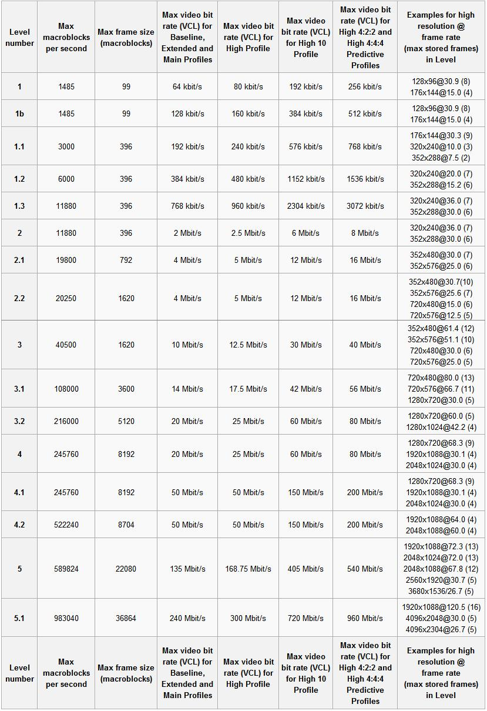

## 1. 视频转换

比如一个avi文件，想转为mp4，或者一个mp4想转为ts。
`ffmpeg -i input.avi output.mp4`
`ffmpeg -i input.mp4 output.ts`

## 2. 提取音频

```
ffmpeg -i test.mp4 -acodec copy -vn output.aac`
上面的命令，默认mp4的audio codec是aac,如果不是，可以都转为最常见的aac。
`ffmpeg -i test.mp4 -acodec aac -vn output.aac
```

## 3. 提取视频

```
ffmpeg -i input.mp4 -vcodec copy -an output.mp4
```

## 4. 视频剪切

下面的命令，可以从时间为00:00:15开始，截取5秒钟的视频。
`ffmpeg -ss 00:00:15 -t 00:00:05 -i input.mp4 -vcodec copy -acodec copy output.mp4`
-ss表示开始切割的时间，-t表示要切多少。上面就是从15秒开始，切5秒钟出来。

## 5. 码率控制

码率控制对于在线视频比较重要。因为在线视频需要考虑其能提供的带宽。

那么，什么是码率？很简单：
bitrate = file size / duration
比如一个文件20.8M，时长1分钟，那么，码率就是：
biterate = 20.8M bit/60s = 20.8*1024*1024*8 bit/60s= 2831Kbps
一般音频的码率只有固定几种，比如是128Kbps，
那么，video的就是
video biterate = 2831Kbps -128Kbps = 2703Kbps。

那么ffmpeg如何控制码率。
ffmpg控制码率有3种选择，-minrate -b:v -maxrate
-b:v主要是控制平均码率。
比如一个视频源的码率太高了，有10Mbps，文件太大，想把文件弄小一点，但是又不破坏分辨率。
`ffmpeg -i input.mp4 -b:v 2000k output.mp4`
上面把码率从原码率转成2Mbps码率，这样其实也间接让文件变小了。目测接近一半。
不过，ffmpeg官方wiki比较建议，设置b:v时，同时加上 -bufsize
-bufsize 用于设置码率控制缓冲器的大小，设置的好处是，让整体的码率更趋近于希望的值，减少波动。（简单来说，比如1 2的平均值是1.5， 1.49 1.51 也是1.5, 当然是第二种比较好）
`ffmpeg -i input.mp4 -b:v 2000k -bufsize 2000k output.mp4`

-minrate -maxrate就简单了，在线视频有时候，希望码率波动，不要超过一个阈值，可以设置maxrate。
`ffmpeg -i input.mp4 -b:v 2000k -bufsize 2000k -maxrate 2500k output.mp4`

## 6. 视频编码格式转换

比如一个视频的编码是MPEG4，想用H264编码，咋办？
`ffmpeg -i input.mp4 -vcodec h264 output.mp4`
相反也一样
`ffmpeg -i input.mp4 -vcodec mpeg4 output.mp4`

当然了，如果ffmpeg当时编译时，添加了外部的x265或者X264，那也可以用外部的编码器来编码。（不知道什么是X265，可以 Google一下，简单的说，就是她不包含在ffmpeg的源码里，是独立的一个开源代码，用于编码HEVC，ffmpeg编码时可以调用它。当然 了，ffmpeg自己也有编码器）
`ffmpeg -i input.mp4 -c:v libx265 output.mp4`
`ffmpeg -i input.mp4 -c:v libx264 output.mp4`

## 7. 只提取视频ES数据

```
ffmpeg –i input.mp4 –vcodec copy –an –f m4v output.h264
```

## 8. 过滤器的使用

### 8.1 将输入的1920x1080缩小到960x540输出:

`ffmpeg -i input.mp4 	scale=960:540 output.mp4`
//ps: 如果540不写，写成-1，即scale=960:-1, 那也是可以的，ffmpeg会通知缩放滤镜在输出时保持原始的宽高比。

### 8.2 为视频添加logo

比如，我有这么一个图片

想要贴到一个视频上，那可以用如下命令：
./ffmpeg -i input.mp4 -i iQIYI_logo.png -filter_complex overlay output.mp4
结果如下所示：

要贴到其他地方？看下面：
右上角：
./ffmpeg -i input.mp4 -i logo.png -filter_complex overlay=W-w output.mp4
左下角：
./ffmpeg -i input.mp4 -i logo.png -filter_complex overlay=0:H-h output.mp4
右下角：
./ffmpeg -i input.mp4 -i logo.png -filter_complex overlay=W-w:H-h output.mp4

### 8.3 去掉视频的logo

语法：-vf delogo=x:y:w:h[:t[:show]]
x:y 离左上角的坐标
w:h logo的宽和高
t: 矩形边缘的厚度默认值4
show：若设置为1有一个绿色的矩形，默认值0。

`ffmpeg -i input.mp4 -vf delogo=0:0:220:90:100:1 output.mp4`
结果如下所示：


## 9. 截取视频图像

`ffmpeg -i input.mp4 -r 1 -q:v 2 -f image2 pic-%03d.jpeg`
-r 表示每一秒几帧
-q:v表示存储jpeg的图像质量，一般2是高质量。
如此，ffmpeg会把input.mp4，每隔一秒，存一张图片下来。假设有60s，那会有60张。


可以设置开始的时间，和你想要截取的时间。
`ffmpeg -i input.mp4 -ss 00:00:20 -t 10 -r 1 -q:v 2 -f image2 pic-%03d.jpeg`
-ss 表示开始时间
-t 表示共要多少时间。
如此，ffmpeg会从input.mp4的第20s时间开始，往下10s，即20~30s这10秒钟之间，每隔1s就抓一帧，总共会抓10帧。

 

## 10. 序列帧与视频的相互转换

把darkdoor.[001-100].jpg序列帧和001.mp3音频文件利用mpeg4编码方式合成视频文件darkdoor.avi：
**$ ffmpeg -i 001.mp3 -i darkdoor.%3d.jpg -s 1024x768 -author fy -vcodec mpeg4 darkdoor.avi**

还可以把视频文件导出成jpg序列帧：
$ ***\*ffmpeg -i bc-cinematic-en.avi example.%d.jpg\****

------

# 其他用法

## 1.输出YUV420原始数据

对于一下做底层编解码的人来说，有时候常要提取视频的YUV原始数据，如下：
`ffmpeg -i input.mp4 output.yuv`

**那如果我只想要抽取某一帧YUV呢？**
你先用上面的方法，先抽出jpeg图片，然后把jpeg转为YUV。
比如：
你先抽取10帧图片。
`ffmpeg -i input.mp4 -ss 00:00:20 -t 10 -r 1 -q:v 2 -f image2 pic-%03d.jpeg```

```

```

然后，你就随便挑一张，转为YUV:
`ffmpeg -i pic-001.jpeg -s 1440x1440 -pix_fmt yuv420p xxx3.yuv`
如果-s参数不写，则输出大小与输入一样。

当然了，YUV还有yuv422p啥的，你在-pix_fmt 换成yuv422p就行啦！


## 2. H264编码profile & level控制

### 背景知识

先科普一下profile&level。（这里讨论最常用的H264）
H.264有四种画质级别,分别是baseline, extended, main, high：

1. Baseline Profile：基本画质。支持I/P 帧，只支持无交错（Progressive）和CAVLC；
2. Extended profile：进阶画质。支持I/P/B/SP/SI 帧，只支持无交错（Progressive）和CAVLC；(用的少)
3. Main profile：主流画质。提供I/P/B 帧，支持无交错（Progressive）和交错（Interlaced）， 也支持CAVLC 和CABAC 的支持；
4. High profile：高级画质。在main Profile 的基础上增加了8x8内部预测、自定义量化、 无损视频编码和更多的YUV 格式；

H.264 Baseline profile、Extended profile和Main profile都是针对8位样本数据、4:2:0格式(YUV)的视频序列。在相同配置情况下，High profile（HP）可以比Main profile（MP）降低10%的码率。 根据应用领域的不同，Baseline profile多应用于实时通信领域，Main profile多应用于流媒体领域，High profile则多应用于广电和存储领域。

下图清楚的给出不同的profile&level的性能区别。
**profile**


**level**



### 2.1 ffmpeg如何控制profile&level

举3个例子吧

```bash 
ffmpeg -i input.mp4 -profile:v baseline -level 3.0 output.mp4
ffmpeg -i input.mp4 -profile:v main -level 4.2 output.mp4
ffmpeg -i input.mp4 -profile:v high -level 5.1 output.mp4
```

如果ffmpeg编译时加了external的libx264，那就这么写：
```bash
ffmpeg -i input.mp4 -c:v libx264 -x264-params "profile=high:level=3.0" output.mp4
```

从压缩比例来说，baseline< main < high，对于带宽比较局限的在线视频，可能会选择high，但有些时候，做个小视频，希望所有的设备基本都能解码（有些低端设备或早期的设备只能解码 baseline），那就牺牲文件大小吧，用baseline。自己取舍吧！

苹果的设备对不同profile的支持。


### 2.2. 编码效率和视频质量的取舍(preset, crf)

除了上面提到的，强行配置biterate，或者强行配置profile/level，还有2个参数可以控制编码效率。
一个是preset，一个是crf。
preset也挺粗暴，基本原则就是，如果你觉得编码太快或太慢了，想改改，可以用profile。
preset有如下参数可用：

> ultrafast, superfast, veryfast, faster, fast, medium, slow, slower, veryslow and placebo.
> 编码加快，意味着信息丢失越严重，输出图像质量越差。

CRF(Constant Rate Factor): 范围 0-51: 0是编码毫无丢失信息, 23 is 默认, 51 是最差的情况。相对合理的区间是18-28.
值越大，压缩效率越高，但也意味着信息丢失越严重，输出图像质量越差。

举个例子吧。
`ffmpeg -i input -c:v libx264 -profile:v main -preset:v fast -level 3.1 -x264opts crf=18`
(参考自：https://trac.ffmpeg.org/wiki/Encode/H.264)

#### 2.3. H265 (HEVC)编码tile&level控制

#### 背景知识

和H264的profile&level一样，为了应对不同应用的需求，HEVC制定了“层级”(tier) 和“等级”(level)。
tier只有main和high。
level有13级，如下所示：


不多说，直接给出怎么用。（supposed你用libx265编码）
`ffmpeg -i input.mp4 -c:v libx265 -x265-params "profile=high:level=3.0" output.mp4`


-----

```bash
# 提取指定时间段视频
ffmpeg -i '火星救援.The.Martian.2015.加长版.BD1080P.国英双语.高清中英双字.mp4' -vcodec libx264 -profile:v baseline -level 3.1 -x264opts crf=20 -ss 00:03:00 -t 00:01:00 -acodec aac output.1080p.h264

# 提取指定时间段音频
ffmpeg -i '火星救援.The.Martian.2015.加长版.BD1080P.国英双语.高清中英双字.mp4' -ss 00:03:00 -to 00:04:00 -acodec aac -vn output.1080p.aac
```